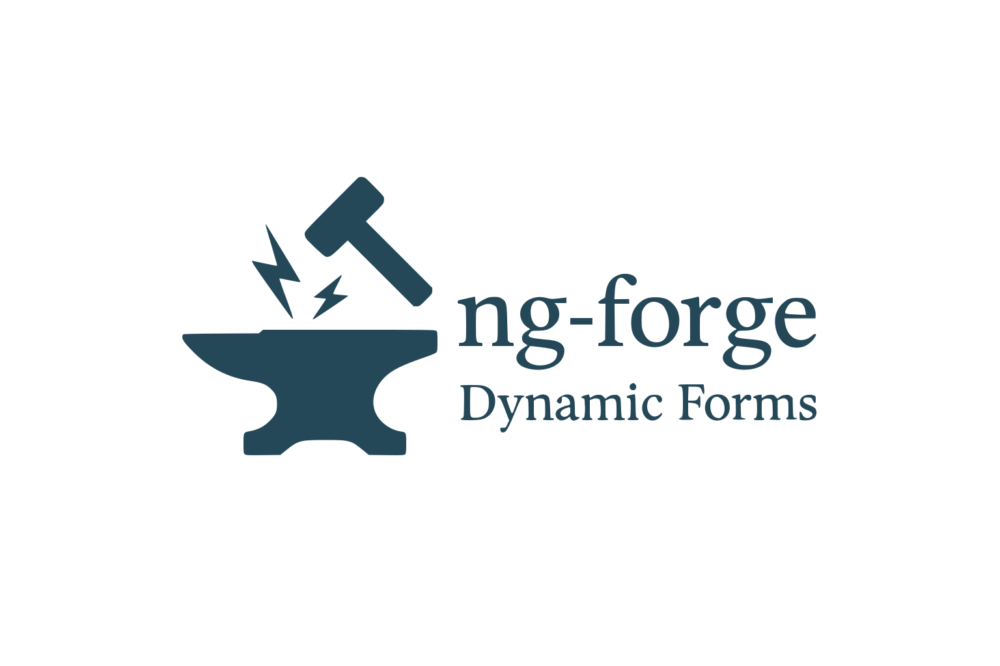

<p align="center">
  
</p>

<p align="center">
  <strong>Stop writing repetitive form code.</strong><br>
  Build type-safe, dynamic Angular forms in minutes, not hours.
</p>

<p align="center">
  <a href="https://github.com/ng-forge/ng-forge/actions/workflows/ci.yml"></a>
  <a href="https://www.npmjs.com/package/@ng-forge/dynamic-forms"></a>
  <a href="https://www.npmjs.com/package/@ng-forge/dynamic-forms"></a>
  <a href="https://opensource.org/licenses/MIT"></a>
  <a href="https://github.com/ng-forge/ng-forge"></a>
  <a href="https://discord.gg/qpzzvFagj3"></a>
</p>

<p align="center">
  <a href="https://ng-forge.com/material/getting-started">📚 Documentation</a> •
  <a href="https://ng-forge.com/material/getting-started">🚀 Getting Started</a> •
  <a href="https://ng-forge.com/material/migrating-from-ngx-formly">🔁 Migrating from ngx-formly</a> •
  <a href="https://discord.gg/qpzzvFagj3">💬 Discord</a> •
  <a href="https://github.com/ng-forge/ng-forge/issues">🐛 Issues</a>
</p>

> **Coming from [ngx-formly](https://formly.dev)?** ng-forge is built on Angular Signal Forms — see the
> [side-by-side migration guide](https://ng-forge.com/material/migrating-from-ngx-formly) for a
> concept-by-concept mapping with full working code on both sides.

---

## ⚡ Quick Start

```bash
npm install @ng-forge/dynamic-forms @ng-forge/dynamic-forms-material
```

```typescript
// app.config.ts
import { provideDynamicForm } from '@ng-forge/dynamic-forms';
import { withMaterialFields } from '@ng-forge/dynamic-forms-material';

export const appConfig: ApplicationConfig = {
  providers: [provideDynamicForm(...withMaterialFields())],
};
```

```typescript
// component.ts
import { DynamicForm, type FormConfig, type InferFormValue } from '@ng-forge/dynamic-forms';

@Component({
  imports: [DynamicForm],
  template: `<form [dynamic-form]="config"></form>`,
})
export class LoginComponent {
  config = {
    fields: [
      { key: 'email', type: 'input', value: '', label: 'Email', required: true, email: true },
      { key: 'password', type: 'input', value: '', label: 'Password', required: true, minLength: 8, props: { type: 'password' } },
      { type: 'submit', key: 'submit', label: 'Sign In' },
    ],
  } as const satisfies FormConfig;
}
```

## ✨ Features

⚡ **Signal Forms** – Native Angular Signal Forms integration

🎯 **Type-Safe** – Full TypeScript inference for form values

🎨 **UI Agnostic** – Material, Bootstrap, PrimeNG, Ionic, or custom

✅ **Validation** – Shorthand validators and conditional validation

🎭 **Conditional Logic** – Dynamic field visibility and requirements

📄 **Multi-Step Forms** – Built-in wizard and pagination support

🌍 **i18n Ready** – Observable/Signal support for labels and messages

## Compatibility

| Angular | @ng-forge/dynamic-forms |
| ------- | ----------------------- |
| 22.x    | 1.x                     |
| 21.x    | 0.x (experimental)      |

Signal Forms are stable as of Angular 22. The `0.x` line targets Angular 21, where Signal Forms were still experimental and could change in patch releases. Each release pins its Angular requirement via `peerDependencies`; npm warns on a mismatch.

## 📦 Packages

| Package                                                                 | Description                                |
| ----------------------------------------------------------------------- | ------------------------------------------ |
| [@ng-forge/dynamic-forms](./packages/dynamic-forms)                     | Core library                               |
| [@ng-forge/dynamic-forms-material](./packages/dynamic-forms-material)   | Material Design                            |
| [@ng-forge/dynamic-forms-primeng](./packages/dynamic-forms-primeng)     | PrimeNG                                    |
| [@ng-forge/dynamic-forms-ionic](./packages/dynamic-forms-ionic)         | Ionic                                      |
| [@ng-forge/dynamic-forms-bootstrap](./packages/dynamic-forms-bootstrap) | Bootstrap 5                                |
| [@ng-forge/dynamic-form-mcp](./packages/dynamic-form-mcp)               | MCP server for AI-assisted form generation |
| [@ng-forge/openapi-generator](./packages/openapi-generator)             | Generate forms from OpenAPI specs          |

## 📖 Documentation

- [Installation](https://ng-forge.com/material/getting-started)
- [Field Types](https://ng-forge.com/material/field-types/text-inputs)
- [Validation](https://ng-forge.com/material/validation/basics)
- [Conditional Logic](https://ng-forge.com/material/dynamic-behavior/conditional-logic)
- [Type Safety](https://ng-forge.com/material/recipes/type-safety)
- [i18n](https://ng-forge.com/material/dynamic-behavior/i18n)
- [Custom Integrations](https://ng-forge.com/material/building-an-adapter)

## 🛠️ Development

```bash
git clone https://github.com/ng-forge/ng-forge.git && cd ng-forge
pnpm install
pnpm run build:libs
pnpm run test
pnpm run serve:docs
```

See [Developer Guides](./guides/) for architecture docs, testing strategy, and creating UI adapters.

## 🙌 Contributors

Special thanks to the people who shaped this framework.

<a href="https://github.com/dereekb"></a>
<a href="https://github.com/0xfraso"></a>

## 🤝 Backers

A huge thank you to the following supporters of ng-forge! 🙏

<a href="https://github.com/scottmccaughey"></a>

## 📄 License

MIT © ng-forge

---

<p align="center">
  <a href="https://github.com/ng-forge/ng-forge">⭐ Star us on GitHub</a> •
  <a href="https://discord.gg/qpzzvFagj3">Join our Discord</a> •
  <a href="https://github.com/ng-forge/ng-forge/issues">Report an Issue</a>
</p>
