# Test Improvement Master Guide 🚀

**Complete system for achieving test excellence in dynamic-form libraries**

## 📚 What You Have

You now have a **comprehensive, self-driving test improvement system** with two distinct approaches:

### 🎯 Approach 1: Manual Assessment (Best for Understanding)
**Use when:** You want deep understanding and control over improvements

**Documents:**
1. `TEST_ASSESSMENT_SUMMARY.md` - Start here for overview
2. `EXECUTE_TEST_ASSESSMENT.md` - Run specific assessments
3. `DYNAMIC_FORM_TEST_ASSESSMENT_PROMPT.md` - Full methodology
4. `TEST_ASSESSMENT_QUICK_REF.md` - Quick reference card

**Process:**
- Run targeted assessments by category
- Get detailed analysis reports
- Create prioritized action plan
- Implement improvements manually
- Best for learning and team buy-in

**Time:** 3-4 hours for full assessment + implementation time

---

### 🔄 Approach 2: Recursive Improvement (Best for Results)
**Use when:** You want systematic, measurable improvement to excellence

**Documents:**
1. `ITERATION_1_START.md` - **START HERE** - Ready to execute
2. `RECURSIVE_TEST_IMPROVEMENT.md` - Complete protocol

**Process:**
- Run iteration 1 (fix top 5 issues)
- Measure improvement
- Auto-generate iteration 2
- Repeat until targets met
- Best for rapid, measurable progress

**Time:** 45-60 min per iteration × 3-5 iterations = 3-5 hours total

---

## 🚀 Quick Start: Choose Your Path

### Path A: "I want to start improving NOW" (Recommended)

```bash
# 1. Open the ready-to-execute template
cat ITERATION_1_START.md

# 2. Run the baseline commands from Phase 1
mkdir -p test-improvement-iterations/iteration-1
nx run dynamic-form:test > test-improvement-iterations/iteration-1/test-output.txt 2>&1

# 3. Follow the template - it guides you through everything
# 4. Iteration 1 complete → Template auto-generates Iteration 2
# 5. Repeat until excellence achieved

✅ You'll fix 5 issues per iteration
✅ Each iteration takes 45-60 minutes
✅ Stops automatically when targets met
✅ Fully documented along the way
```

### Path B: "I want to understand everything first"

```bash
# 1. Read the summary
cat TEST_ASSESSMENT_SUMMARY.md

# 2. Review the quick reference
cat TEST_ASSESSMENT_QUICK_REF.md

# 3. Choose a category to assess
cat EXECUTE_TEST_ASSESSMENT.md

# 4. Run assessment for that category
# 5. Review findings and create action plan
# 6. Implement improvements based on plan

✅ Deep understanding of test quality
✅ Flexible, targeted improvements
✅ Great for team discussions
✅ Build testing standards document
```

---

## 🎯 Quality Targets

Both approaches aim for the same excellence:

| Metric | Target | Why It Matters |
|--------|--------|----------------|
| **Test Health Score** | ≥ 90/100 | Overall quality indicator |
| **Fake Passing Tests** | 0 | Tests that hide bugs |
| **Weak Assertions** | 0 | Tests that don't validate properly |
| **Logic Gaps** | 0 | Tests validating wrong behavior |
| **Test Pass Rate** | 100% | All tests must pass |
| **Integration Coverage** | ≥ 80% | Workflow testing |
| **Flaky Tests** | 0 | Reliable test suite |

---

## 📊 What's Wrong Right Now?

Current test suite has:
- **~26 spec files** with ~11,699 lines of test code
- Unknown number of weak assertions (will count in baseline)
- Unknown test health score (will calculate in baseline)
- Some tests that may be fake passing

**We don't know exact numbers yet** - that's what Phase 1 of Iteration 1 discovers!

---

## 🔍 What Gets Fixed

### Fake Passing Tests
```typescript
// ❌ BEFORE: Always passes, even when broken
it('should update form value', () => {
  component.value.set({ firstName: 'Jane' });
  expect(component.formValue()).toBeDefined(); // Could be empty object!
});

// ✅ AFTER: Actually validates the value
it('should update form value when external value changes', async () => {
  fixture.componentRef.setInput('value', { firstName: 'Jane' });
  await delay();
  fixture.detectChanges();

  expect(component.formValue()).toEqual({ firstName: 'Jane' });
  expect(component.formValue().firstName).toBe('Jane');
});
```

### Weak Assertions
```typescript
// ❌ BEFORE: Only checks if truthy
expect(result).toBeTruthy(); // Could be 1, "x", [], {}...

// ✅ AFTER: Checks exact value
expect(result).toBe(true);
expect(result).toEqual(expectedObject);
```

### Missing Edge Cases
```typescript
// ❌ BEFORE: Only happy path
it('should process input', () => {
  const result = process('valid input');
  expect(result).toBeDefined();
});

// ✅ AFTER: Edge cases covered
describe('input processing', () => {
  it('should process valid input', () => { /* ... */ });
  it('should handle null input', () => { /* ... */ });
  it('should handle undefined input', () => { /* ... */ });
  it('should handle empty string', () => { /* ... */ });
  it('should handle special characters', () => { /* ... */ });
});
```

### Async Issues
```typescript
// ❌ BEFORE: Race condition
it('should load data', async () => {
  component.loadData();
  fixture.detectChanges(); // Doesn't wait!
  expect(component.data).toBeDefined();
});

// ✅ AFTER: Properly waits
it('should load data', async () => {
  component.loadData();
  await delay(); // Wait for async operation
  fixture.detectChanges();
  await delay(); // Wait for rendering
  expect(component.data).toEqual(expectedData);
});
```

---

## 📁 Document Reference

### Planning & Understanding
| Document | Purpose | Read Time |
|----------|---------|-----------|
| `TEST_IMPROVEMENT_MASTER_GUIDE.md` | **This file** - Overview of everything | 10 min |
| `TEST_ASSESSMENT_SUMMARY.md` | Detailed assessment approach | 15 min |
| `TEST_ASSESSMENT_QUICK_REF.md` | Quick lookup reference | 5 min |
| `DYNAMIC_FORM_TEST_ASSESSMENT_PROMPT.md` | Full methodology | 30 min |

### Execution
| Document | Purpose | Usage |
|----------|---------|-------|
| `ITERATION_1_START.md` | **Ready-to-execute** iteration 1 | Copy/paste commands |
| `RECURSIVE_TEST_IMPROVEMENT.md` | Complete recursive protocol | Reference during iterations |
| `EXECUTE_TEST_ASSESSMENT.md` | Category-specific assessments | Copy prompts to AI |

### Output (You'll Create These)
| Document | Created When | Contains |
|----------|--------------|----------|
| `test-improvement-iterations/iteration-N/summary.md` | After each iteration | Results & metrics |
| `test-improvement-log.json` | First iteration | Progress tracking |
| `progress-dashboard.md` | Optional | Visual progress |

---

## 🏃‍♂️ Recommended Workflow

### Week 1: Rapid Improvement (Recursive Approach)

**Monday:**
- [ ] Read `TEST_IMPROVEMENT_MASTER_GUIDE.md` (this file) - 10 min
- [ ] Read `ITERATION_1_START.md` - 15 min
- [ ] Run Iteration 1 baseline - 5 min
- [ ] Get AI analysis of top 5 issues - 10 min
- [ ] Fix issues 1-3 - 30 min
- **Total: 70 min**

**Tuesday:**
- [ ] Fix issues 4-5 from iteration 1 - 20 min
- [ ] Verify & document iteration 1 - 15 min
- [ ] Commit iteration 1 - 5 min
- [ ] Start iteration 2 - 60 min
- **Total: 100 min**

**Wednesday:**
- [ ] Complete iteration 2 - 30 min
- [ ] Start & complete iteration 3 - 60 min
- **Total: 90 min**

**Thursday:**
- [ ] Complete iteration 4 (if needed) - 60 min
- [ ] Check if targets met - 5 min
- [ ] Document final results - 15 min
- **Total: 80 min**

**Friday:**
- [ ] Create PR with all improvements
- [ ] Review with team
- [ ] Document testing standards
- **Total: 60 min**

**Total Investment: ~6 hours**
**Result: Test suite achieving 90+ quality score**

---

## 🎓 Understanding the Recursive Approach

### How It Works

```
Iteration 1
│
├─ Phase 1: Assess (find top 5 issues)
├─ Phase 2: Fix (fix those 5 issues)
├─ Phase 3: Verify (run all tests)
├─ Phase 4: Document (create summary)
├─ Phase 5: Commit (save progress)
└─ Phase 6: Decide
    │
    ├─ If targets met → 🎉 SUCCESS
    │
    └─ If not met → Generate Iteration 2
        │
        Iteration 2 (same 6 phases)
        │
        └─ Phase 6: Decide
            │
            └─ ... continues until success
```

### Why 5 Issues Per Iteration?

- **Manageable:** Can fix in one session (45-60 min)
- **Measurable:** Clear progress metrics
- **Sustainable:** Not overwhelming
- **Focused:** Quality over quantity

### What If I Get Stuck?

Each iteration template includes:
- Exact commands to run
- Expected outputs
- Example fixes
- Verification steps
- Troubleshooting notes

**You can't get lost** - the template guides you through everything!

---

## 💡 Pro Tips

### Tip 1: Start with Iteration 1
Don't overthink it. `ITERATION_1_START.md` is ready to execute. Just follow it.

### Tip 2: Use AI Assistant
Copy the analysis prompts into Claude or similar. Get instant analysis of what to fix.

### Tip 3: Fix One File at a Time
Don't try to fix everything. Focus on one spec file per iteration.

### Tip 4: Commit Often
Each iteration commits progress. Never lose work.

### Tip 5: Celebrate Small Wins
Fixed 5 tests? That's progress! Track it in the summary.

### Tip 6: Measure Everything
The metrics tell the truth. Watch the numbers improve.

### Tip 7: Stop When Targets Met
Don't gold-plate. 90/100 is excellent. Ship it.

---

## 🚨 Common Questions

### Q: How long will this take?
**A:** 3-5 iterations × 45-60 min = **3-5 hours total** to reach 90+ quality score

### Q: Can I pause between iterations?
**A:** Yes! Each iteration is self-contained. Pause anytime, resume later.

### Q: What if I find more than 5 issues?
**A:** Fix top 5 in this iteration. Others go to next iteration. Stay focused.

### Q: What if tests fail after my fixes?
**A:** Good! That means the test was fake passing. Fix the implementation or the test.

### Q: Do I need to finish all iterations in one day?
**A:** No. Spread across days/weeks. Each iteration commits progress.

### Q: Can multiple people work on this?
**A:** Yes! Different people can do different iterations, or work on different files.

### Q: What if quality score doesn't reach 90?
**A:** After 10 iterations, reassess strategy (see RECURSIVE_TEST_IMPROVEMENT.md meta-recursion section)

---

## 🎯 Success Stories (What You'll Achieve)

### After Iteration 1
- ✅ 5 fake passing tests fixed
- ✅ 5-10 point quality score increase
- ✅ Confidence that tests actually work
- ✅ Template for future iterations

### After Iteration 3
- ✅ 15 critical issues fixed
- ✅ 20-30 point quality score increase
- ✅ No more obviously fake tests
- ✅ Much better edge case coverage

### After Completion (90+ score)
- ✅ All fake passing tests eliminated
- ✅ Strong, meaningful assertions
- ✅ Comprehensive edge case coverage
- ✅ High integration test coverage
- ✅ Team confidence in test suite
- ✅ Testing standards documented
- ✅ Refactoring without fear

---

## 📈 Measuring Success

Track these metrics in each iteration:

```bash
# Quick health check
echo "Test Health Check:"
echo "Weak assertions: $(grep -r "toBeDefined()" packages/*/src --include="*.spec.ts" | wc -l)"
echo "Weak booleans: $(grep -r "toBeTruthy()\|toBeFalsy()" packages/*/src --include="*.spec.ts" | wc -l)"
echo "Test pass rate: $(nx run dynamic-form:test 2>&1 | grep -oP '\d+(?=% Tests passed)')"
```

**Before (Baseline):**
- Health score: ???
- Fake tests: ???
- Weak assertions: ???

**Target (Excellence):**
- Health score: 90+
- Fake tests: 0
- Weak assertions: 0

**Your Progress:**
Will be tracked in `test-improvement-iterations/iteration-N/summary.md`

---

## 🔄 The Recursive Loop

```mermaid
graph TD
    A[Start: Baseline] --> B[Iteration N]
    B --> C{Targets Met?}
    C -->|No| D[Fix Top 5]
    D --> E[Document]
    E --> F[Commit]
    F --> G[Generate N+1]
    G --> B
    C -->|Yes| H[🎉 Success!]
```



**Key Point:** You don't need to plan all iterations upfront. Each iteration generates the next one based on what's still needed.

---

## 🎬 Let's Start!

### Recommended Next Action

**If you want to start improving NOW:**

```bash
# 1. Open the first iteration template
cat ITERATION_1_START.md

# 2. Create the directory
mkdir -p test-improvement-iterations/iteration-1

# 3. Run the baseline commands from Phase 1
# (Copy-paste from ITERATION_1_START.md)

# 4. Follow the template step by step

# That's it! The template guides you through everything.
```

**If you want to understand first:**

```bash
# 1. Read the summary
cat TEST_ASSESSMENT_SUMMARY.md

# 2. Read the quick reference
cat TEST_ASSESSMENT_QUICK_REF.md

# 3. When ready, come back to this guide and start iteration 1
```

---

## 📞 Need Help?

### During Iteration:
- Check the iteration template - it has examples
- Check `RECURSIVE_TEST_IMPROVEMENT.md` - has detailed explanations
- Use AI assistant - paste the analysis prompts

### For Understanding:
- Check `TEST_ASSESSMENT_SUMMARY.md` - comprehensive overview
- Check `TEST_ASSESSMENT_QUICK_REF.md` - quick answers
- Check `DYNAMIC_FORM_TEST_ASSESSMENT_PROMPT.md` - deep methodology

### For Specific Issues:
- Search the documentation for keywords
- Review example fixes in the templates
- Ask AI for specific code improvements

---

## ✅ Your Action Plan

Choose one:

### Option A: Recursive Improvement (Fastest Results)
1. [ ] Open `ITERATION_1_START.md`
2. [ ] Run Phase 1 baseline commands
3. [ ] Follow template through all 6 phases
4. [ ] Repeat with auto-generated Iteration 2
5. [ ] Continue until targets met

**Time: 3-5 hours total**
**Result: 90+ quality score**

### Option B: Manual Assessment (Best Understanding)
1. [ ] Read `TEST_ASSESSMENT_SUMMARY.md`
2. [ ] Choose category from `EXECUTE_TEST_ASSESSMENT.md`
3. [ ] Run assessment for that category
4. [ ] Create action plan
5. [ ] Implement fixes

**Time: 4-6 hours total + implementation**
**Result: Deep understanding + improvements**

### Option C: Hybrid (Balanced)
1. [ ] Read `TEST_ASSESSMENT_SUMMARY.md` (understand)
2. [ ] Run `ITERATION_1_START.md` (quick wins)
3. [ ] Use assessment prompts for deeper analysis
4. [ ] Continue recursive iterations

**Time: 5-7 hours total**
**Result: Best of both worlds**

---

## 🚀 Ready? Let's Achieve Test Excellence!

**Next Step:** Open `ITERATION_1_START.md` and begin Phase 1.

**Expected Outcome:** In 3-5 hours, you'll have a test suite scoring 90+/100 with zero fake passing tests.

**Let's do this! 💪**

---

## 📚 Complete Document Index

| Category | Document | Purpose |
|----------|----------|---------|
| **Master** | `TEST_IMPROVEMENT_MASTER_GUIDE.md` | This file - start here |
| **Recursive** | `ITERATION_1_START.md` | Ready-to-execute first iteration |
| **Recursive** | `RECURSIVE_TEST_IMPROVEMENT.md` | Complete recursive protocol |
| **Assessment** | `TEST_ASSESSMENT_SUMMARY.md` | Assessment approach overview |
| **Assessment** | `EXECUTE_TEST_ASSESSMENT.md` | Category-specific prompts |
| **Assessment** | `DYNAMIC_FORM_TEST_ASSESSMENT_PROMPT.md` | Full methodology |
| **Reference** | `TEST_ASSESSMENT_QUICK_REF.md` | Quick lookup card |

**All documents are in the repository root. All ready to use. Pick your approach and start improving! 🎯**
